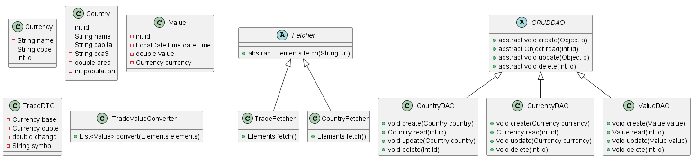
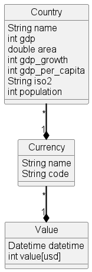

# ExChanger

## Table of contents
* [General info](#general-info)
* [Sources](#sources)
* [Technologies](#technologies)
* [Setup](#setup)
* [Screenshots](#screenshots)
* [Potential improvements](#potential-improvements)
* [Team members](#team-members)

## General info
This is our final project for Java Deep Dive. We will create an application that 
scrapes www.valutakurser.dk for any relevant data to analyze and display it in a meaningful way.
This makes it possible for anyone interested to keep track of currency changes and exchange rates across several
different currencies.

The main purpose of the application is to provide a service that can be used to keep track of currency changes and
exchange rates across several different currencies. The application will be able to store this information in a database
and keep track of the change in the exchange rate of the currencies.

The project is meant to combine the knowledge we have gained throughout the course and apply it to a real world problem.

## Sources
- Valuta course: https://www.valutakurser.dk/
- Country API: https://restcountries.com/v3.1/currency/

## Technologies

- Java 17
- JPA 3.1.0
- PostgreSQL 42.6.0
- Hibernate 6.2.4.Final
- Maven 4.0.0
- Junit 5.8.1
- Docker 24
- Jsoup 1.16.1
- Gson 2.10.1

## Setup

In order to run the program you need to have some sort of ERD database running.
We recommend using Docker and pgAdmin with Hibernate and JPA as the code is spefifically
designed for these technologies.

We had two databases running on our local machines.
One for testing (called "valuta_test") and one for development (called "valuta").

## Screenshots

This is an EER diagram of our database. It shows the relations between the different tables and how they are connected.

This is a class diagram to show the different Java classes we have implemented as well as their fields and relations.

Lastly we have a domain model to show the different entities and their relations, that are applicable to a real world scenario.

## Potential improvements
- We could have improved the program by implementing a way to handle countries having multiple currencies or multiple capitals (specific to South Africa).
- It would also have been interesting to add a population density to the countries.
- We also found an interesting website that had more currencies/countries than the one we used, but it was not possible for us to scrape the data from it.

## Team members
- Jack - https://github.com/TheRealJackiBoi
- Julius - https://github.com/Juliuslassen
- Bjarke - https://github.com/artiecodes
- William - https://github.com/asphixia

